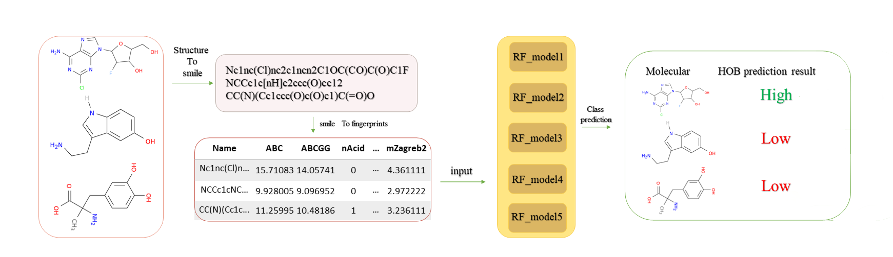

# 
 Predictions can also be made directly on our online server at http://www.icdrug.com/ICDrug/A

## Conda environment

     $ conda HobPre create -f Hob_env.yml

Python 3.6

   - Mordred==1.2.0

   - scikit-learn==0.23.2

   - pandas==1.1.1

   - numpy==1.19.2
   
   - matplotlib==3.3.4

## Usage

     $ conda activate HobPre

     $ python HOB_predict.py your_model_path your_smiles.txt cutoff

example:

     $ python HOB_predict.py model smiles.txt 20
     
     Parameter meaning:
     model_path:The folder where the model to be used for prediction is located
     smiles.txt:input smiles file,one per each line
     cutoff:  50. Use F=50% as the cut-off value. If F>50%, the predicted oral availability is qualitatively high.             
              20. Use F=20% as the cut-off value. If F>20%, the predicted oral availability is qualitatively high.

## Reference

Min Wei, Xudong Zhang, Xiaolin Pan, Bo Wang, Changge Ji, Yifei Qi, and John Z.H. Zhang.HobPre: accurate prediction of human oral bioavailability for small molecules  *(submitted)*
     
*The data used in this paper can be obtained from [`hob_data_set.xlsx `](https://github.com/whymin/HOB/blob/main/hob_data_set.xlsx)

## Model Parameters License

The HOB prediction models are made available for non-commercial use only, under the terms of the Creative Commons Attribution-NonCommercial 4.0 International (CC BY-NC 4.0) license. You can find details at: https://creativecommons.org/licenses/by-nc/4.0/legalcode
