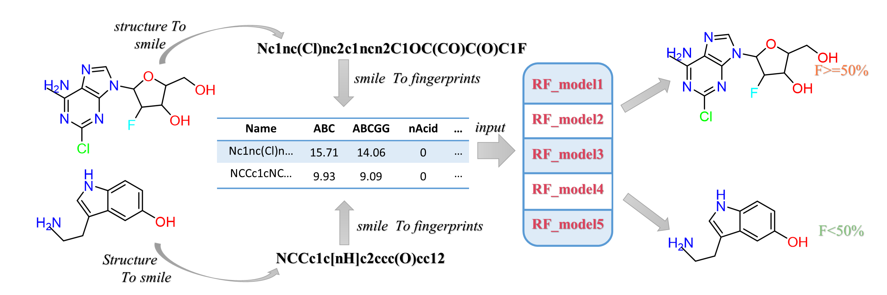

Predictions can also be made directly on our online server at http://protein.org.cn/hob

## Conda environment

     $ conda HobPre create -f Hob_env.yml

Python 3.6

   - Mordred==1.2.0

   - scikit-learn==0.23.2

   - pandas==1.1.1

   - numpy==1.19.2

## Usage

     $ conda activate HobPre

     $ python HOB_predict.py your_model_path your_smiles.txt

example:

     $ python HOB_predict.py model smiles.txt

## Reference

*Min Wei, Xudong Zhang, Xiaolin Pan, Bo Wang, Changge Ji, Yifei Qi, and John Z.H. Zhang.In Silico Prediction of Human Oral Bioavailability with Improved Accuracy (submitted)*
     
*The data used in this paper can be obtained from `all_data_set.xlsx `

## Model Parameters License

The HOB prediction models parameters are made available for non-commercial use only, under the terms of the Creative Commons Attribution-NonCommercial 4.0 International (CC BY-NC 4.0) license. You can find details at: https://creativecommons.org/licenses/by-nc/4.0/legalcode
